# OpenVDB and NanoVDB in Unreal

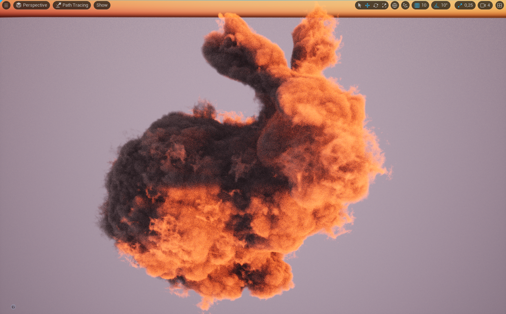

This repo is a non-official Unreal plugin that can read OpenVDB and NanoVDB files in Unreal.
This plugin was made for Unreal 5 on Windows 64 bit.

## Introduction

This experimental plugin allows importing [OpenVDB](https://www.openvdb.org/) and [NanoVDB](https://developer.nvidia.com/nanovdb) files into [Unreal](https://www.unrealengine.com/en-US/), and basic manipulation of VDB grids in an Unreal environment.

> OpenVDB is an Academy Award-winning open-source C++ library allowing efficient storage and manipulation of sparse volumetric data on three-dimensional grids  
 
Although [OpenVDB](https://www.openvdb.org/) is extremely popular in offline rendering, especially in the movie industry, it is surprisingly under-appreciated in the realtime industry, mostly for performance reasons.
Thankfully, NVIDIA recently released [NanoVDB](https://developer.nvidia.com/nanovdb), a lighter and GPU-friendly version of OpenVDB.

> NanoVDB employs a compacted, linearized, read-only representation of the VDB tree structure

**We add support for both these libraries in Unreal, giving artists access to a new range of possibilities**. Once imported, every VDB grids are converted to NanoVDB for better performance.
 
The **goal** isn't to provide a reference viewer for VDB grids (although we do offer some interesting options) but to **foster an experimental environment to play with sparse volumes**. We want this plugin to be **as generic as possible** to allow a maximum of customization and tinkering, whether you are a (technical) artist or a programmer.

We provide direct support for (simplistic) realtime rendering with **Unreal materials**, with the option to implement your very own raymarching HLSL code in the material editor. If you are a programmer and don't care about Unreal materials but still don't want to reinvent the wheel, we also provide a more **traditional and easy-to-modify path to render volumes** (ideal to implement the latest rendering and/or denoising paper). We even hacked our way into the **pathtracer** to allow for offline rendering experimentations. If you want to sample a volume to create an impressive **Niagara system**, that is also possible. 

## Features
- Import OpenVDB files
- Import NanoVDB files
- Convert every VDB file to NanoVDB, once imported 
- Viewport visualization 
- Unreal volumetric materials support
- Ambient light and first directional light support
- Niagara modules can sample VDB Grids
- Option to convert Grids to Texture3Ds
- Pseudo pathtracer integration, for offline experiments
- More traditional graphics integration (no materials) for faster iterations

## Installation
Download the repo and copy it in your project `Plugins` folder. Unreal will need to be recompiled.

If you are not able to compile Unreal, you can alternatively use the precompiled binaries packages in [Releases](https://github.com/eidosmontreal/unreal-vdb/releases).

---
## First steps

Create or get an OpenVDB file, for example [bunny.vdb](https://artifacts.aswf.io/io/aswf/openvdb/models/bunny.vdb/1.0.0/bunny.vdb-1.0.0.zip) from the [OpenVDB repository](https://www.openvdb.org/download/).

Drag and drop your VDB file in the content browser, or use the `Import asset` option. An import window will show up, where you can select a few options and which grids you want to process (VDB files can contain multiple grids).

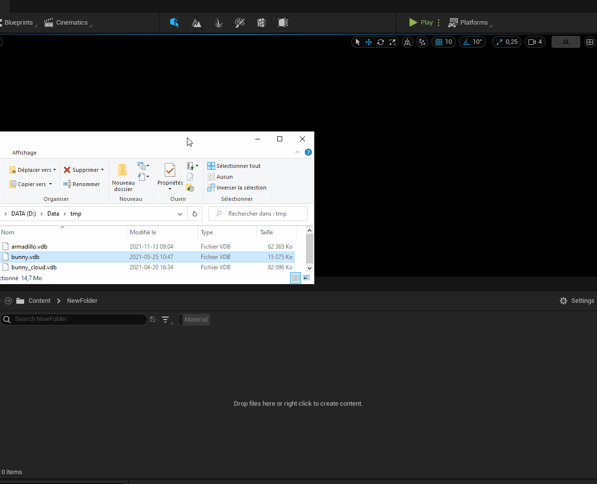

We decided to import each grid as a single Unreal asset called `VdbVolume` (or sometimes `NanoVdb`) for finer control. We only support *FogVolumes* and *LevelSets* for now, and only support floating grids (no vectors yet). Once imported, every grid is stored as a NanoVDB grid, allowing for better performance on the GPU.

`VdbVolume` can be added to a Level by creating a `VdbActor` (manually, or by simply drag and dropping the asset in the viewport).

* *FogVolumes* `VdbActors` require a **density** `VdbVolume` to render (we only support density volumes for now, as it is the most common case).
* *LevelSets* `VdbActors` require a narrow-band level set `VdbVolume`.

Double click on `VdbVolume` assets to check their properties.

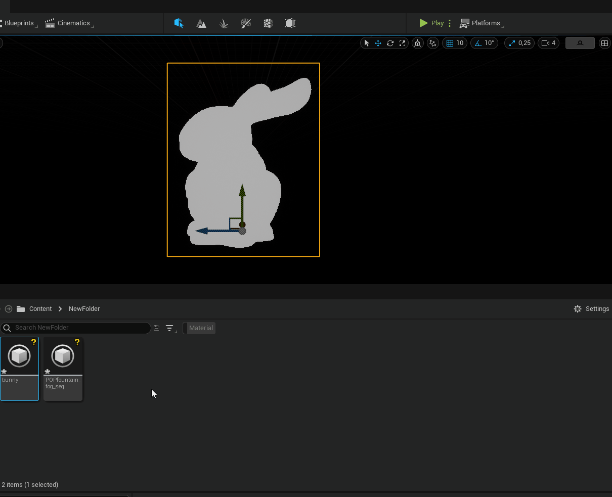

### Quantization

NanoVDB allows compressing your data to be more lightweight. 
We let users select their own option during import.
This choice can be modified at any time with an asset reimport.

| No quantization (32f) | Fp4 Quantization |
| ----------- | ----------- |
| 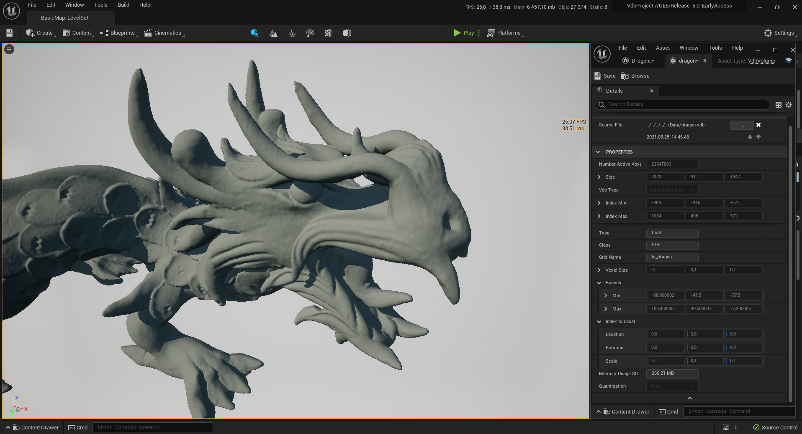 |  |

## Sequences / Animations

You can also import a sequence of VDB files, if the plugin can detect a continuous file sequence.

 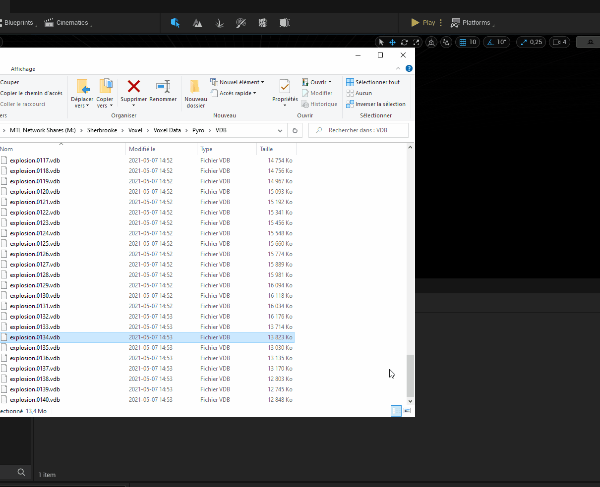
 
 Sequences can be previewed in the editor, and played in-game depending on the selected options.
 
 
 
 We also added support for the Sequencer, allowing precise animation control from users.
 
 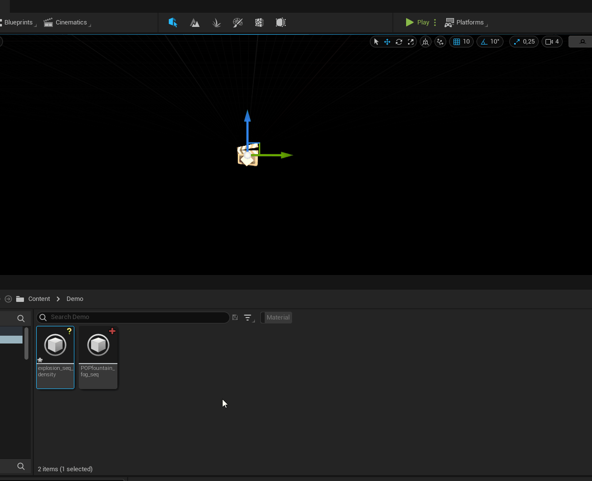
 

## Advanced examples

You can now play with Unreal materials to achieve the look you want. `VdbActors` will only display if they use a **`Volume material`**. We provide a few examples that are already compatible with VDB rendering. 

* *LevelSets* (aka *Distance fields*) behave mostly like regular opaque meshes
* *FogVolumes* are transparent objects that we render by **raymarching inside the volumes**. They can be really expensive to render, and even more if we sample the directional light.

Note that like any other mesh or texture, **performance may drastically vary** between a small and big volume, and is also **screen dependent** (the closer you get to the volume, the more expensive it is to render).

Again, we want to reiterate that it is **not our goal to provide the best rendering** (quality and/or performance) possible.
We mostly want to help the community get in the right direction by providing all the relevant setup code, and allow adopters to rapidly experiment with their own rendering tests without much effort.

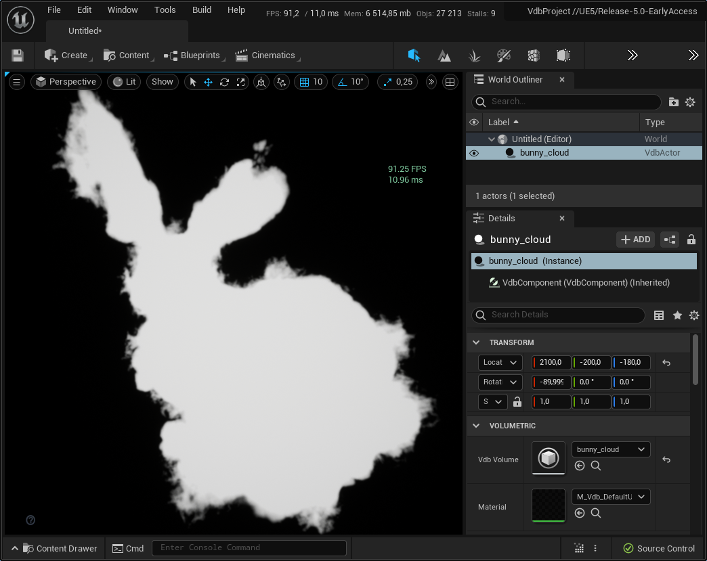

I would be delighted to see what the community comes up with, so please post your shaders and renders online (twitter or others) so that we can all enjoy the results, and show the world that volumetric rendering is a viable solution now, even in realtime.   

### The Unreal way (aka artist-friendly) 
You can create your own `Materials` based on the provided examples. 
We only support `Volume materials` (which forces you to use the *Additive* blend mode, but we ignore it), with `Unlit` and `Default Lit` shading models. Any other models have undefined behavior while rendering VDB volumes.

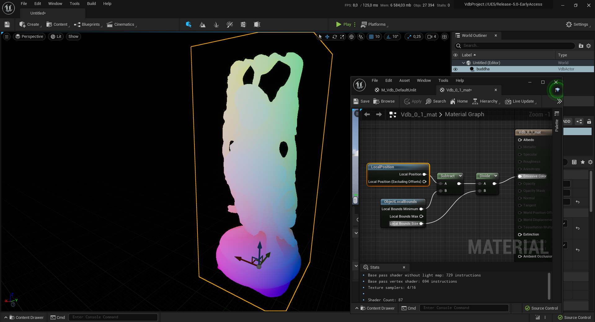
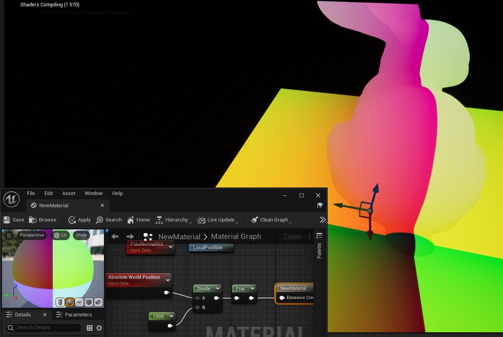

* `Albedo` is only used with the `Default Lit` shading mode
* `Emissive` is radiance added at each raymarch step
* `Extinction` acts as a **multiplier** of the volume density (*FogVolumes* only)
* `Ambient Occlusion` acts as a final multiplier on the volume radiance. 

The `Default Lit` shading mode will sample both the ambient light (approximation), and the principal directional light. The volumes are self-shadowed by the directional light. Note that sampling the directional light at every step of the raymarching process can be really expensive and slow for *FogVolumes*. By using a `custom material expression` defining `#define IGNORE_DIR_LIGHT`, we can remove directional light support, and significantly improve rendering speed while still sampling ambient lighting. Keep in mind that this `custom node` has to be connected to a material pin to be evaluated.
<include ignore_dir_light.png>

Using the same trick, artists can also implement their own raymarching algorithm by using special defines (different for *LevelSets* and *FogVolumes*). This however requires more coding skills and understanding of HLSL and NanoVDB API. Please refer to `M_Vdb_CustomHLSL_FogVolume` and `M_Vdb_CustomHLSL_LevelSet` materials for more information.

### Niagara

`VdbVolumes` can also be sampled from custom Niagara modules. We provide a NanoVdb `Data Interface`, to allow all kinds of operations on the volumes. For complex operations and complete custom access, use the `CustomHLSL` node.

| Vdb Data Interface | Custom Niagara module and emitter |
| ----------- | ----------- |
| 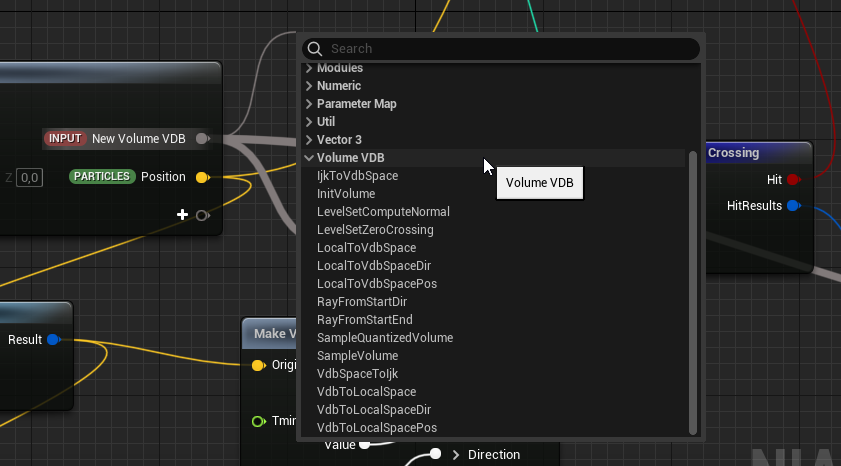 | 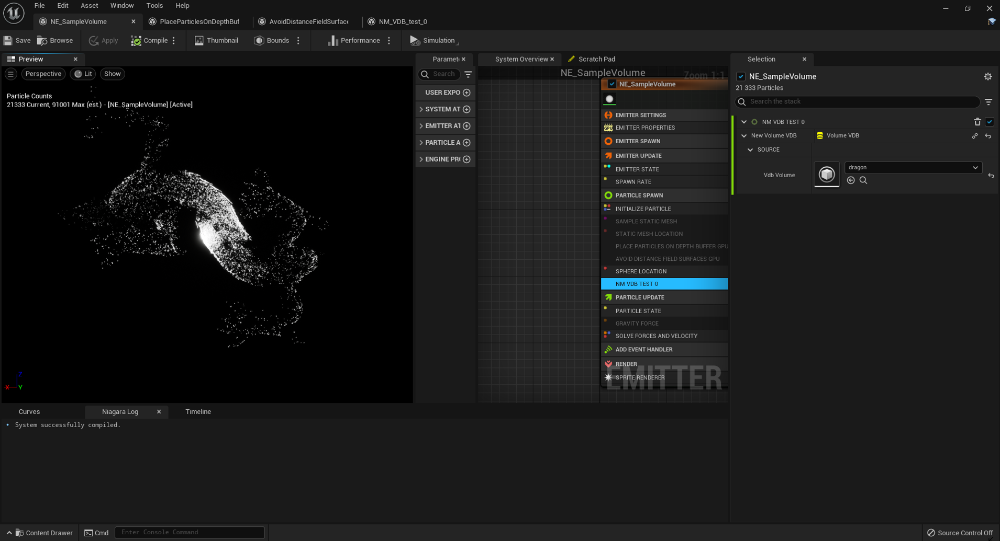 |  |

### The programmers way

If you are a programmer and don't care about Unreal features (picking, materials, pipeline integration etc.), we added a more straightforward option to render `VdbVolumes`. 
We call it the **Research** mode. It is accessible through the `VdbResearchActor` (and `VdbResearchComponent`).

It is using a self-contained and lightweight code-path to render `VdbVolumes` on screen. Iterations are much faster, recompiling shaders only takes a couple seconds (compared to minutes with Unreal shaders) and you need not worry about classes like `VertexFactory`, `MeshMaterialShader`, `MeshPassProcessor`, `SceneViewExtensions` etc. anymore. You can also optionally add a denoiser as a rendering post-process.

This **Research** mode is also compatible with [Unreal's *path tracer*](https://docs.unrealengine.com/4.26/en-US/RenderingAndGraphics/RayTracing/PathTracer/), allowing for interesting offline possibilities (graphics research, architecture renders etc.).   

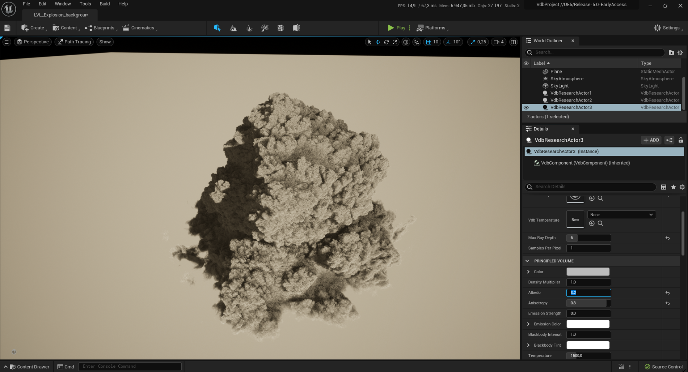 
Cloud dataset provided by [Walt Disney Animation Studios](https://www.disneyanimation.com/resources/clouds/) under the [CCA-SA 3.0 Licence](http://creativecommons.org/licenses/by-sa/3.0/)

| | Bunny shaped clouds | |
| ----------- | ----------- | ----------- |
| 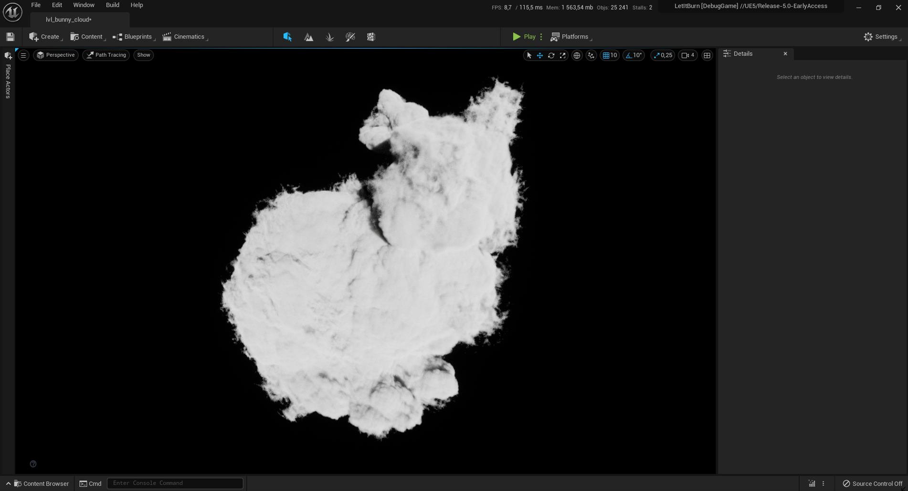 |  |  |

 
[Cloud Stanford Bunny](https://artifacts.aswf.io/io/aswf/openvdb/models/bunny_cloud.vdb/1.0.0/bunny_cloud.vdb-1.0.0.zip), from the [OpenVDB repository](https://www.openvdb.org/download/)

---
## Known limitations

This is an experimental plugin. Customizing Unreal's renderer proved to be challenging, so be aware that there are probably a lot of features that don't work out-of-the box. Most Unreal pipeline features will probably not work (debug buffers, global overrides, shadows, transparency orders etc.). Some may be easy to fix/implement while others aren't possible yet without modifying the renderer's code. 
 
Regarding VDB features:
* We only support *FogVolumes* and *LevelSets* (aka *Distance Fields*)
* We only support float grids (for now)
* No CPU support

We only support Windows 64 bit plateform, and Unreal 5.

Disclaimer: This is my first project using Unreal and OpenVDB/NanoVDB, this plugin started as an educational project to learn the engine. Unreal is definitely complex and I'm sure there are other and smarter ways to integrate such volumetric features. Feel free to [contact me](https://twitter.com/LambertTibo) if you have some valuable feedback !

---
## Dependencies

This plugin uses:

| Library | Version |
| ----------- | ----------- |
| [OpenVDB](https://github.com/AcademySoftwareFoundation/openvdb/releases) | 8.1.1 |
| [NanoVDB](https://github.com/AcademySoftwareFoundation/openvdb/tree/master/nanovdb/nanovdb) | 32.3 |

While NanoVDB is mostly a header-only library, OpenVDB relies on these external libraries to read VDB files. Please refer to each library for copyrights.

| Library | Version |
| ----------- | ----------- |
| [Boost](https://www.boost.org/users/history/version_1_76_0.html) | 1.76 |
| [Blosc](https://github.com/Blosc/c-blosc/releases) | 1.18 |
| [Intel's TBB](https://github.com/oneapi-src/oneTBB) | 2018.0 |
| [LibZ](https://github.com/madler/zlib) | 1.2.11 |
| [OpenEXR](https://github.com/AcademySoftwareFoundation/openexr/releases) | 2.3.0 |

Note that some other Unreal plugins may use different versions of these libraries and may cause conflicts.

## License and Contributions

Licensed under the Apache License, Version 2.0 (the "License"). See LICENSE for the full license text or you may obtain a copy of the License at

    http://www.apache.org/licenses/LICENSE-2.0
    
We welcome contributions via a Contributor License Agreement, as asked by our legal team.   

## Acknowledgements

This plugin was developped by Thibault Lambert with the help of Sami Ibrahim, while being employed by Eidos-Montreal/Sherbrooke.

Many thanks to Cedric Sophie for testing and giving feedback about this plugin.

